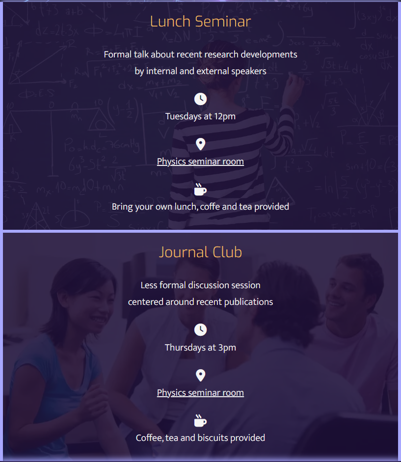
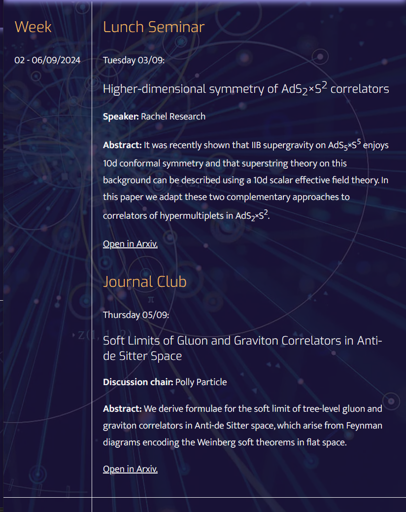
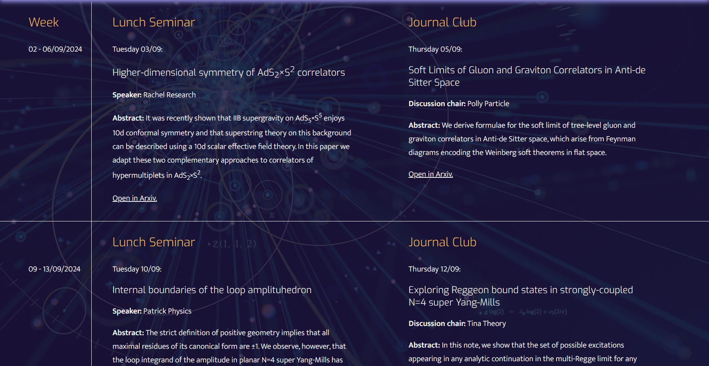
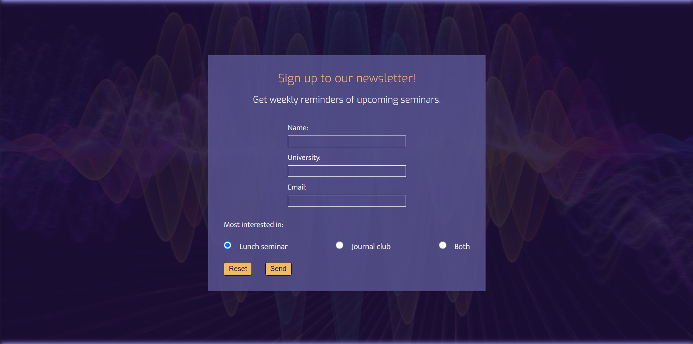

# [Particle Physics Seminars](https://theresaabl.github.io/pp-seminars)

Particle Physics Seminars is a website dedicated to particle physics seminars organised by an academic research group. The goal is to provide clear and easily accessible information about upcoming talks and journal clubs for academic researchers and students in the field of particle physics. Users can quickly get information about the types of seminars provided as well as the time and location they take place in. They can access a list of upcoming talks, sign up to contribute to a seminar themselves, contact the organizers or sign up to a newsletter.

Plase view the live site here - [Particle Physics Seminars](https://theresaabl.github.io/pp-seminars)

source: [amiresponsive](https://ui.dev/amiresponsive?url=https://theresaabl.github.io/pp-seminars)

## UX

### Target Audience

This page was designed always having the target audience in mind. The target audience are academic researchers in particle physics, as well as students in the field. This audience is looking to get the most precise and concise information as quickly as possible. They are always busy with their research and most likely access the website from a laptop or desktop. The site has to be very straightforward so they do not lose any time looking for information. They can find out what they are looking for at first sight. It also has to be very simple to see what actions they can take and where. Furthermore, the goal is to provide a visually pleasing website fitting the theme of particle physics.

### Color Scheme

The goal for the color scheme was to give the website a clean and scientific but also dark and mysterious look. I used [coolors.co](https://coolors.co/1d0f39-a8a8ff-f5f5f5-595492-eebb62) to generate my color palette:

The following colors are used throughout the site:

- `#a8a8ff` used for primary highlights.
- `#eebb62` used for secondary highlights.
- `#f5f5f5` used for other text.
- `#1d0f39` used as background color. 
- `#595492` used as background color for forms. 

These colors fit the theme of particle physics. The site is generally dark-purple with light-purple highlights and off-white text and the orange highlights are reminiscent of images of particle collisions.

### Typography

I used the following fonts and icons:

- [Exo](https://fonts.google.com/specimen/Exo) was used for the logo and headings (the fall-back font is 'sans-serif').

- [Mukta Vaani](https://fonts.google.com/specimen/Mukta+Vaani) was used for all other text (the fall-back font is 'sans-serif').

- [Font Awesome](https://fontawesome.com) icons were used throughout the site, such as the newsletter icon in the header or the social media icons in the footer.

## User Stories

There are three primary user groups:

- Internal researchers (members of the university which organises the seminars)
- External researchers (work at different universities)
- students

### Internal Researchers

- As an internal researcher, I would like to see an overview of upcoming talks, so that I can attend seminars and stay up-to-date on lates research developments.
- As an internal researcher, I would like to see details of upcoming talks, so that I can prepare myself before attending.
- As an internal researcher, I would like to sign up to a weekly newsletter with details on upcoming talks, so that I can attend seminars regularly without having to look up details every week.
- As an internal researcher, I would like to sign up to give a talk in the lunch seminar, so that I can promote my own research or find possible collaborators.
- As an internal researcher, I would like to sign up to suggest a paper for the journal club, so that I can discuss recent developments and get input from my peers.
- As an internal researcher, I would like to access information about external speakers of upcoming talks, so that I can find new talent to hire.

### External Researchers

- As an external researcher, I would like to see what types of seminars are organised and where and when they take place, so I can see which ones I want to attend or contribute to.
- As an external researcher, I would like to see an overview of upcoming talks, so that I can attend seminars and stay up-to-date on latest research developments.
- As an external researcher, I would like to see details of upcoming talks, so that I can prepare myself before attending.
- As an external researcher, I would like to acces contact information, so that I can see how to get to the seminars or how to contact the organisers with any questions.
- As an external researcher, I would like to sign up to give a talk in the lunch seminar, so that I can promote my own research, find possible collaborators or find someone to hire me.
- As an external researcher, I would like to sign up to suggest a paper for the journal club, so that I can discuss recent developments and network with researchers from the organising group.

### Students

- As a student, I would like to see what types of seminars are organised and where and when they take place, so I can see which ones I want to attend.
- As a student, I would like to see an overview of upcoming talks, so that I can attend seminars and stay up-to-date on latest research developments.
- As a student, I would like to see an overview of upcoming talks, so that I can attend seminars to network with researchers and find someone to hire me.
- As a student, I would like to see details of upcoming talks, so that I can prepare myself before attending.
- As a student, I would like to sign up to a weekly newsletter with details on upcoming talks, so that I can attend seminars regularly without having to look up details every week.
- As a student, I would like to acces contact information, so that I can contact the organisers with any questions.

## Wireframes

I have used [Balsamiq](https://balsamiq.com/wireframes) to design my site wireframes. 

Note that I deliberately chose to develop wireframes with a focus on laptop/desktop screen sizes, even though the project was developed using a mobile-first approach. This is because the target audience of this site (see [Target Audience](#target-audience)) are particle physics researchers. We can safely assume that this group would access the site from a laptop or desktop most of the time, while working on their research or administration tasks.

Any differences between the wireframes and the final website are due to creative decisions in the development process. The site was designed in a way that made the adaptations for mobile devices almost obvious.

### Desktop Wireframes

| Page | Screenshots |
| --- | --- |
| Home |  |
| Upcoming |  |
| Participate |  |
| Archive | (see [Future Features](#future-features)) |
| Contact |  |
| Newsletter |  |
| Error 404 page |  | 

## Features

### Existing Features

| Feature | Notes | Screenshot |
| --- | --- | --- |
| [**Logo**](index.html) | The logo appears in the header across the entire website. The goal is for the user to know the site purpose at first sight. It has a clean and straight-forward look, as this is what the target audience is looking for. |  |
| [**Navbar / Dropdown menu**](index.html) | The navigation menu must allow the user to quickly assess what content they can find on the site as well as what action they can take and where. The navbar shows as a dropdown menu for mobile devices (see [code inspiration source](#content)) |  |
| | Dropdown menu is open |  |
| | For larger tablets, as well as laptops and desktops, the navbar is fully visible. |  |
| [**Newsletter icon**](index.html) | The newsletter icon appears in the header across all pages (except the Newsletter page and Newsletter confirmation page, since it is not needed there). The goal is for the user to notice the option to sign up to the newsletter at first sight and across all pages, and to immediatly know how to do so. |  |
| [**Footer**](index.html) | The footer appears on the bottom of the page across all pages. The goal is to show the copyright information and links to social media platforms. The social media links are icons, which show clearly which social media platforms are available related to this site. |   |
| [**Hero image section**](index.html) | The hero image on the home page is a large image of a particle collision fitting the theme of the page perfectly. The goal is to leave a positiv visual impression and to provide a short and informative slogan through the overlayed text, as to what this website is about. |  |
| [**About section**](index.html) | The about section on the home page provides concise information about the two types of seminars that are organised. The goal is for the user to quickly know which types of seminars there are, when and where they take place and whether drinks and snacks are provided. The background images were chosen to fit the theme of the respective seminar type (i.e. a person writing on a board for the lunch seminars and a group of people in a discussion for the journal club). |  |
| About section for desktop devices |   |  |
| [**Upcoming Talks**](upcoming.html) | The upcoming talks page shows a list of upcoming talks, including the date, as well as the speaker or discussion chair and the title and abstract of papers presented or discussed. It also provides a link to the relevant publication. The goal is to provide this information to the users, such that they not only know which talks take place but can also look at the speakers and publications in advance to prepare for the seminar. The background image shows a particle collision which fits the theme of the research talks presented on this page. |  |
| Upcoming Talks for desktop devices |   |  |
| [**Participate form**](participate.html) | The participate form provides the option to sign up to contribute to a seminar. The goal is that any user that wants to participate can easily know how to sign up and then do so. They can choose whether they want to give a talk at the lunch seminar or suggest a paper for discussion at the journal club. They can also provide information about the publications they want to present or discuss and of course, enter there personal information. The background image for this page, as well as the according form confirmation page, show a blackboard with lots of physics formulas written on it. This fits the page which is about participating in research seminars. |  |
| [**Participate form confirmation**](participate-confirmation.html) | Once a user submits a participate form (with valid input), a confirmation page is shown. This page includes links to the home and contact pages, and the user is redirected to the home page automatically after 10 seconds. The goal is to provide the user with clear feedback, so that they know that their message was indeed sent. |  |
| [**Contact information**](contact.html) | On top of the contact page the contact information with the seminars' location is provided, including an email address to contact the organisers. |  |
| [**Interactive map**](contact.html) | Next on the contact page, is an interactive map that allows the user to directly look at the location of the seminars in Google Maps. |  |
| [**Contact form**](contact.html) | The contact page also includes a contact form, for the user to get in touch with any message that is beyond the scope of the participate or newsletter forms. |  |
| Contact page for desktop devices | The background image for the contact page shows the cosmic web symbolising the many connections that can be made through this page. |  |
| [**Contact form confirmation**](contact-confirmation.html) | Once a user submits a contact form (with valid input), a confirmation page is shown. See Participate form confirmation. |  |
| [**Newsletter sign-up form**](newsletter.html) | When the user clicks the newsletter icon (see above), the newsletter sign-up page appears. It includes a form, where users can sign up to receive weekly reminders of upcoming seminars. Users leave their personal information and can indicate which type of seminar they are interested in. The background image for the newsletter page (and the respective form confirmation page) shows a quantum wave function symbolising the messages sent out through the newsletter. |  |
| [**Newsletter sign-up form confirmation**](newsletter-confirmation.html) | Once a user submits a newsletter sign-up form (with valid input), a confirmation page is shown. See Participate form confirmation. |  |
| [**Error 404 page**](404.html) | When a page is not found on the website, an error 404 occurs and the error page shows. The goal is to provide a clear and funny message to the user to show that something went wrong and how they can get back to the website. The background image for this page is a black hole, fitting with the theme of getting lost. |  |

### Future Features

- **Calendar in upcoming talks section**

    It would be interesting to include an interactive calendar in the upcoming talks page to display all past and upcoming seminars and export calender entries to personal calendars.

- **Archive**

    In the initial wireframes I included an Archive page (see below) and then decided in the planning stages that this was beyond the scope of this project. Therefore, it would be very desirable to implement an Archive page as a future feature. This page would contain details, such as dates, titles, speakers etc. of past seminars. Most notably it would include videos of all past talks. 

    

- **Online participation sign-up**

    It would add to the value of the page, if users from anywhere in the world could sign up to participate in any of the seminars remotely. This could be done through a sign-up page where users can register to participate in a zoom webinar or meeting.

## Tools & Technologies Used

-  used to generate README and TESTING templates.
-  used for version control. (`git add`, `git commit`, `git push`)
-  used for secure online code storage.
-  used as a cloud-based IDE for development.
-  used for the main site content.
-  used for the main site design and layout.
-  used for hosting the deployed front-end site.
-  used for creating wireframes.
-  used as an interactive map on my site.
-  used for the icons.
-  used to help come up with an error message for the 404 page and themes for the backgrounds of the participate, contact and newsletter pages.
-  used to convert all images to webp for faster website.
-  used to compress images for faster website.
-  used to shorten link for interactive map on contact site.
-  used to generate favicon for the website.

## Testing

> [!NOTE]  
> For all testing, please refer to the [TESTING.md](TESTING.md) file.

## Deployment

The site was deployed to GitHub Pages. The steps to deploy are as follows:

- In the [GitHub repository](https://github.com/theresaabl/pp-seminars), navigate to the Settings tab. 
- From the source section drop-down menu, select the **Main** Branch, then click "Save".
- The page will be automatically refreshed with a detailed ribbon display to indicate the successful deployment.

The live link can be found [here](https://theresaabl.github.io/pp-seminars).

### Local Deployment

This project can be cloned or forked in order to make a local copy on your own system.

#### Cloning

You can clone the repository by following these steps:

1. Go to the [GitHub repository](https://github.com/theresaabl/pp-seminars).
2. Locate the Code button above the list of files and click it.
3. Select if you prefer to clone using HTTPS, SSH, or GitHub CLI and click the copy button to copy the URL to your clipboard.
4. Open Git Bash or Terminal.
5. Change the current working directory to the one where you want the cloned directory.
6. In your IDE Terminal, type the following command to clone my repository:
	- `git clone https://github.com/theresaabl/pp-seminars.git`
7. Press Enter to create your local clone.

Alternatively, if using Gitpod, you can click below to create your own workspace using this repository.

Please note that in order to directly open the project in Gitpod, you need to have the browser extension installed.
A tutorial on how to do that can be found [here](https://www.gitpod.io/docs/configure/user-settings/browser-extension).

#### Forking

By forking the GitHub Repository, we make a copy of the original repository on our GitHub account to view and/or make changes without affecting the original owner's repository.
You can fork this repository by using the following steps:

1. Log in to GitHub and locate the [GitHub Repository](https://github.com/theresaabl/pp-seminars).
2. At the top of the Repository (not top of page) just above the "Settings" Button on the menu, locate the "Fork" Button.
3. Once clicked, you should now have a copy of the original repository in your own GitHub account!

### Local VS Deployment

There are no notable differences between the local version in Gitpod and the live deployment site on GitHub Pages.

## Credits

### Content

| Source | Location | Notes |
| --- | --- | --- |
| [Code Institute Love Running walkthrough project](https://github.com/Code-Institute-Solutions/love-running-v3) | Header on all pages | code inspiration for the dropdown menu for mobile devices |
| [Markdown Builder](https://tim.2bn.dev/markdown-builder) | README and TESTING | tool to help generate the Markdown files |
| [ArXiv](https://arxiv.org) | Upcoming page | paper titles and abstracts |

### Media

| Source | Location | Type | Notes |
| --- | --- | --- | --- |
| [Twemoji](https://github.com/twitter/twemoji/blob/master/assets/svg/269b.svg) | entire page | image | favicon on all pages |
| [Popular Mechanics](https://hips.hearstapps.com/hmg-prod/images/higgs-boson-conceptual-illustration-royalty-free-illustration-1659096743.jpg) | home page | image | hero image background |
| [The University of Tokyo](https://www.u-tokyo.ac.jp/content/400117925.jpg) | home page | image | about section background for lunch seminar div |
| [ontesol](https://cdn-ontesol.pressidium.com/wp-content/uploads/2014/06/iStock_000021014694Small.jpg) | home page | image | about section background for journal club div |
| [MrWallpaper](https://mrwallpaper.com/images/hd/quantum-particle-collision-in-high-energy-physics-7456mziexm479eca.jpg) | upcoming page | image | background |
| [Spektrum](https://static.spektrum.de/fm/912/f2000x857/iStock-936903524_i000pixels.jpg) | participate and participate confirmation pages | image | background |
| [Space.com](https://cdn.mos.cms.futurecdn.net/P6zNb5J9FM6V2KjLJTGVQS.jpg) | contact and contact confirmation pages | image | background |
| [Caltech Science Exchange](https://caltechsites-prod.s3.amazonaws.com/scienceexchange/images/Quantum_Physics-HeaderImage-F.2e16d0ba.fill-933x525-c100.jpg) | newsletter and newsletter confirmation pages | image | background |
| [Nasa Science](https://smd-cms.nasa.gov/wp-content/uploads/2023/06/PIA16695_large-jpg.webp) | error page | image | background |

### Acknowledgements

I would like to thank my Code Institute mentor, [Tim Nelson](https://github.com/TravelTimN) for his support and insight throughout the development of this project.
