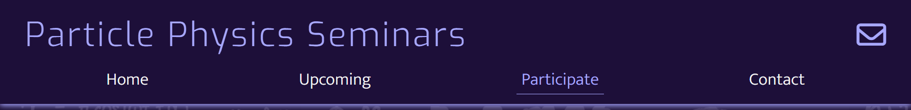
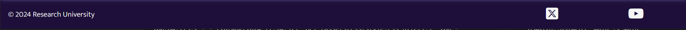
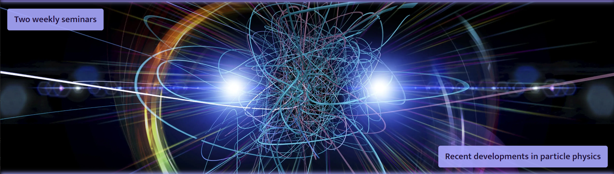
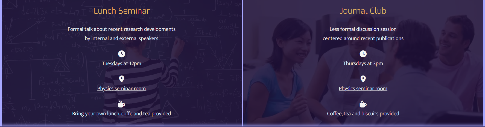
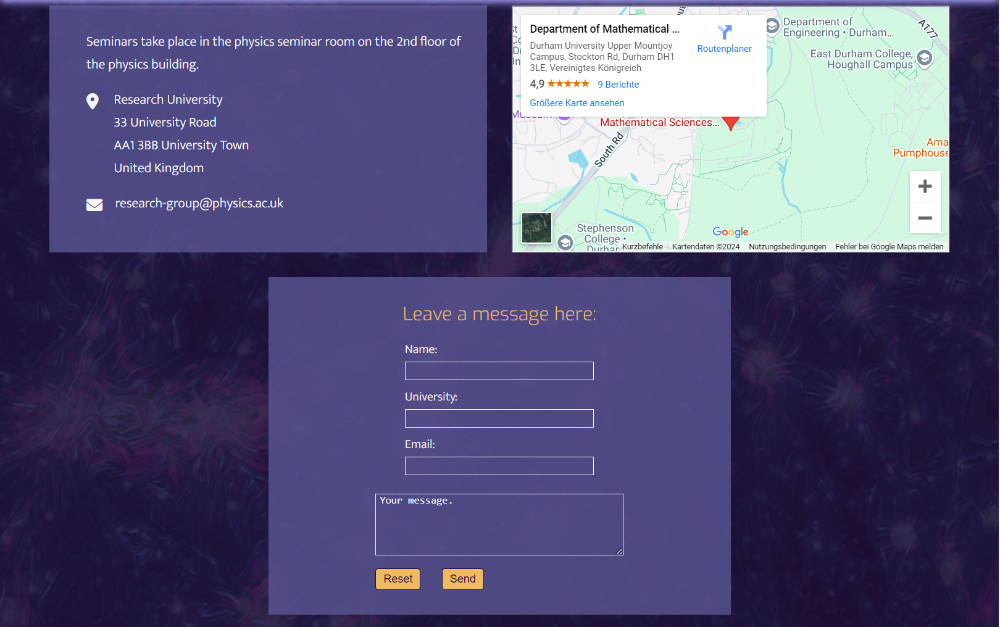
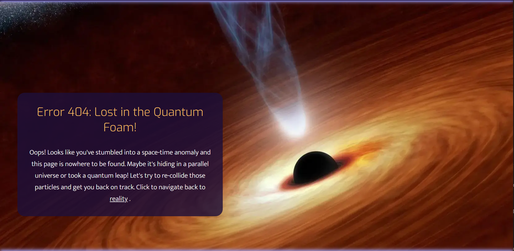

# [Particle Physics Seminars](https://theresaabl.github.io/pp-seminars)

Particle Physics Seminars (PP Seminars) (live link can be found [here](https://theresaabl.github.io/pp-seminars)) is a website with the goal to provide information about upcoming seminars for researchers in particle physics.

**Continue describing here!** 

(what the project hopes to accomplish, who it is intended to target, and how it will be useful to the target audience, am i responsive screenshot)

source: [amiresponsive](https://ui.dev/amiresponsive?url=https://theresaabl.github.io/pp-seminars)

---

**Delete**
callouts:

> [!NOTE]  
> BLUE: Highlights information that users should take into account, even when skimming.

> [!TIP]  
> GREEN: Optional information to help a user be more successful.

> [!IMPORTANT]  
> PURPLE: Crucial information necessary for users to succeed.

> [!WARNING]  
> YELLOW: Critical content demanding immediate user attention due to potential risks.

> [!CAUTION]  
> RED: Negative potential consequences of an action.

**Delete**

## UX

**explain design processes**

### Colour Scheme

- `#F5F5F5` used for primary text. (?)
- `#A8A8FF` used for primary highlights. (?) 
- `#EEBB62` used for secondary highlights. 
- `#1D0F39` used as background color. 
- `#595492` used as form background color. 

I used [coolors.co](https://coolors.co/1d0f39-a8a8ff-f5f5f5-595492-eebb62) to generate my color palette.

### Typography

Fonts and icons

- [Exo](https://fonts.google.com/specimen/Exo) was used for the logo and headings.

- [Mukta Vaani](https://fonts.google.com/specimen/Mukta+Vaani) was used for all other secondary **(?)** text.

- [Font Awesome](https://fontawesome.com) icons were used throughout the site, such as the newsletter icon in the header or the social media icons in the footer.

## User Stories

user stories:

- internal researcher
- external researcher
- student
- researcher looking to hire
- researcher looking to be hired
- researcher looking for collaborators

### New Site Users

- As a new site user, I would like to ____________, so that I can ____________.
- As a new site user, I would like to ____________, so that I can ____________.
- As a new site user, I would like to ____________, so that I can ____________.
- As a new site user, I would like to ____________, so that I can ____________.
- As a new site user, I would like to ____________, so that I can ____________.

### Returning Site Users

- As a returning site user, I would like to ____________, so that I can ____________.
- As a returning site user, I would like to ____________, so that I can ____________.
- As a returning site user, I would like to ____________, so that I can ____________.
- As a returning site user, I would like to ____________, so that I can ____________.
- As a returning site user, I would like to ____________, so that I can ____________.

## Wireframes

Explain why chose desktop wireframes only

(To follow best practice, wireframes were developed for mobile, tablet, and desktop sizes.)

I've used [Balsamiq](https://balsamiq.com/wireframes) to design my site wireframes.

### Desktop Wireframes

 Click here to see the Desktop Wireframes 

 - Home

 - Upcoming

 - Participate

 - Archive (see [Future Features](#future-features))

 - Contact

 - Newsletter

 - Error 404 page

## Features

Describe each feature as detailed as possible, what value for user, focus on who website is for, what do they want to achieve, how this is best way to help achieve this.
reference the specific project files that implement the features. Include screenshots! 

### Existing Features

 Click here to see all existing features. 

- **Logo**

    - Details 

- **Navbar/ Dropdown menu**

    - Details

    - dropdown menu open:

    - Navbar for larger tablets, laptops and desktops:

- **Newsletter icon**

- **Footer**

    - Details

- **Hero image section**

    - Details

- **About section**

    - Details

- **Upcoming Talks**

    - Details

- **Participate form**

    - Details

- **Participate form confirmation**

    - Details

- **Contact information**

    - Details

- **Interactive map**

    - Details

- **Contact form**

    - Details

- **Contact form confirmation**

    - Details

- **Newsletter sign-up form**

    - Details

- **Newsletter sign-up form confirmation**

    - Details

- **Error 404 page**

    - Details

### Future Features

- **Calendar in upcoming talks section**

    - It would be interesting to include an interactive calendar in the upcoming talks page to display all past and upcoming seminars and export calender entries to personal calendars.

- **Archive**

    - In the initial wireframes I included an Archive page and then decided in the planning stages that this was beyond the scope of this project. Therefore, it would be very desirable to implement an Archive page as a future feature. This page would contain details, such as dates, titles, speakers etc. of past seminars. Most notably it would include videos of all past talks. 

 Click here to see the desktop wireframe for a possible Archive page.

- **Online participation sign-up**

    - It would add to the value of the page, if users from anywhere in the world could sign up to participate in any of the seminars remotely. This could be done through a sign-up page where users can register to participate in a zoom webinar or meeting.

## Tools & Technologies Used

-  used to generate README and TESTING templates.
-  used for version control. (`git add`, `git commit`, `git push`)
-  used for secure online code storage.
-  used as a cloud-based IDE for development.
-  used for the main site content.
-  used for the main site design and layout.
-  used for hosting the deployed front-end site.
-  used for creating wireframes.
-  used as an interactive map on my site.
-  used for the icons.
-  used to help come up with an error message for the 404 page and themes for the backgrounds of the participate, contact and newsletter pages.
-  to convert all images to webp for faster website.
-  used to compress images for faster website.
-  used to shorten link for interactive map on contact site.
-  used to generate favicon for the website.

## Testing

> [!NOTE]  
> For all testing, please refer to the [TESTING.md](TESTING.md) file.

## Deployment

The site was deployed to GitHub Pages. The steps to deploy are as follows:

- In the [GitHub repository](https://github.com/theresaabl/pp-seminars), navigate to the Settings tab 
- From the source section drop-down menu, select the **Main** Branch, then click "Save".
- The page will be automatically refreshed with a detailed ribbon display to indicate the successful deployment.

The live link can be found [here](https://theresaabl.github.io/pp-seminars)

### Local Deployment

This project can be cloned or forked in order to make a local copy on your own system.

#### Cloning

You can clone the repository by following these steps:

1. Go to the [GitHub repository](https://github.com/theresaabl/pp-seminars) 
2. Locate the Code button above the list of files and click it 
3. Select if you prefer to clone using HTTPS, SSH, or GitHub CLI and click the copy button to copy the URL to your clipboard
4. Open Git Bash or Terminal
5. Change the current working directory to the one where you want the cloned directory
6. In your IDE Terminal, type the following command to clone my repository:
	- `git clone https://github.com/theresaabl/pp-seminars.git`
7. Press Enter to create your local clone.

Alternatively, if using Gitpod, you can click below to create your own workspace using this repository.

Please note that in order to directly open the project in Gitpod, you need to have the browser extension installed.
A tutorial on how to do that can be found [here](https://www.gitpod.io/docs/configure/user-settings/browser-extension).

#### Forking

By forking the GitHub Repository, we make a copy of the original repository on our GitHub account to view and/or make changes without affecting the original owner's repository.
You can fork this repository by using the following steps:

1. Log in to GitHub and locate the [GitHub Repository](https://github.com/theresaabl/pp-seminars)
2. At the top of the Repository (not top of page) just above the "Settings" Button on the menu, locate the "Fork" Button.
3. Once clicked, you should now have a copy of the original repository in your own GitHub account!

### Local VS Deployment

any differences between the local version, and the live deployment site on GitHub Pages..

## Credits

### Content

| Source | Location | Notes |
| --- | --- | --- |
| [Code Institute Love Running walkthrough project](https://github.com/Code-Institute-Solutions/love-running-v3) | Header | code inspiration for the dropdown menu for mobile devices |
| [Markdown Builder](https://tim.2bn.dev/markdown-builder) | README and TESTING | tool to help generate the Markdown files |

... papers?

### Media

This project is for educational purpose only.

| Source | Location | Type | Notes |
| --- | --- | --- | --- |
| [Twemoji](https://github.com/twitter/twemoji/blob/master/assets/svg/269b.svg) | entire page | image | favicon on all pages |
| [Popular Mechanics](https://hips.hearstapps.com/hmg-prod/images/higgs-boson-conceptual-illustration-royalty-free-illustration-1659096743.jpg) | home page | image | hero image background |
| [The University of Tokyo](https://www.u-tokyo.ac.jp/content/400117925.jpg) | home page | image | about section background for lunch seminar div |
| [ontesol](https://cdn-ontesol.pressidium.com/wp-content/uploads/2014/06/iStock_000021014694Small.jpg) | home page | image | about section background for journal club div |
| [MrWallpaper](https://mrwallpaper.com/images/hd/quantum-particle-collision-in-high-energy-physics-7456mziexm479eca.jpg) | upcoming page | image | background |
| [Spektrum](https://static.spektrum.de/fm/912/f2000x857/iStock-936903524_i000pixels.jpg) | participate and participate confirmation pages | image | background |
| [Space.com](https://cdn.mos.cms.futurecdn.net/P6zNb5J9FM6V2KjLJTGVQS.jpg) | contact and contact confirmation pages | image | background |
| [Caltech Science Exchange](https://caltechsites-prod.s3.amazonaws.com/scienceexchange/images/Quantum_Physics-HeaderImage-F.2e16d0ba.fill-933x525-c100.jpg) | newsletter and newsletter confirmation pages | image | background |
| [Nasa Science](https://smd-cms.nasa.gov/wp-content/uploads/2023/06/PIA16695_large-jpg.webp) | error page | image | background |

### Acknowledgements

- I would like to thank my Code Institute mentor, [Tim Nelson](https://github.com/TravelTimN) for his support throughout the development of this project.
