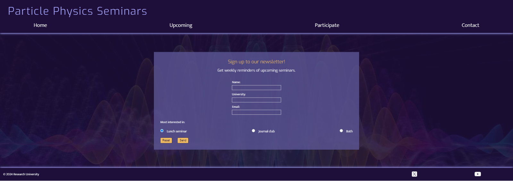
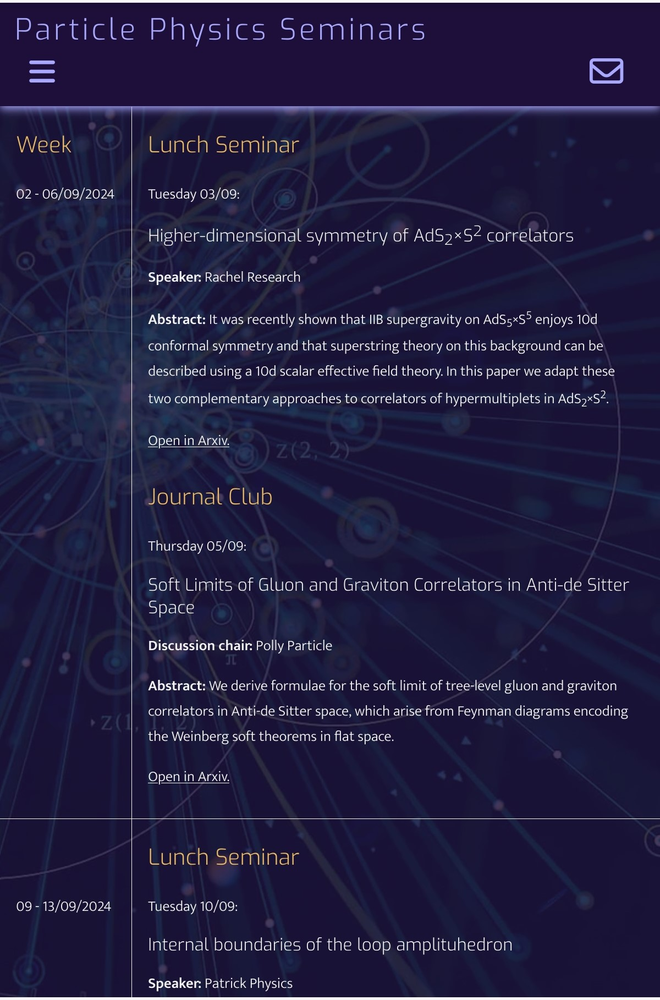

# Testing

> [!NOTE]  
> Return back to the [README.md](README.md) file.

## Feature-by-Feature Testing (TO DO)

In this section, you need to convince the assessors that you have conducted enough testing to legitimately believe that the site works well.
Essentially, in this part, you should go over all of your project's features, and ensure that they all work as intended,
with the project providing an easy and straightforward way for the users to achieve their goals.
Go through each feature of your portfolio site and detail the testing process for each.

Explain the functionality and demonstrate how it aligns with the intended purpose. This could include:

- Navigation: Ensuring smooth transitions between pages, links directing to the correct destinations.
- Responsive Design: Checking for compatibility across various devices and screen sizes.
- Portfolio Display: Verifying that projects are properly showcased with accurate descriptions, images, and links.
- Contact Form: Testing the form submission process, ensuring the user receives a confirmation, and you receive the message.

## Code Validation

### HTML

I have used the recommended [HTML W3C Validator](https://validator.w3.org) to validate all of my HTML files.

When validating the index.html file, one warning came up which could be easily fixed (see screenshots below). After that, all files were validated with no errors or warnings.

| Directory | File | Screenshot | Notes |
| --- | --- | --- | --- |
|  | index.html |  | On first validation, one warning was shown:     A heading was missing in the hero image section, this was quickly fixed by adding a hidden heading and can be tracked in [this issue](https://github.com/theresaabl/pp-seminars/issues/8) .|
|  | upcoming.html |  | |
|  | participate.html |  | |
|  | participate-confirmation.html |  | |
|  | contact.html |  | |
|  | contact-confirmation.html |  | |
|  | newsletter.html |  | |
|  | newsletter-confirmation.html |  | |
|  | 404.html |  | |

### CSS

I have used the recommended [CSS Jigsaw Validator](https://jigsaw.w3.org/css-validator) to validate my CSS file.

| Directory | File | Screenshot | 
| --- | --- | --- | 
| assets/css | style.css |  | 

## Browser Compatibility

I have tested my deployed project on multiple browsers to check for compatibility issues. The browsers I have tested on are:
- [Chrome](https://www.google.com/chrome)
- [Firefox](https://www.mozilla.org/firefox)
- [Edge](https://www.microsoft.com/edge)

| Browser | Home | Upcoming | Participate | Contact | Newsletter | Form confirmation pages| 404 page | Notes |
| --- | --- | --- | --- | --- | --- | --- | --- | -- |
| Chrome |  |  | |  |  |       |  |  Works as expected |
| Firefox |  |  | |  |  |        |  |  Works as expected, with a slight difference in opacity of form placeholder text.|
| Edge |  |  | |  |  |        |  |  Works as expected |

Note that the radio buttons in the participate and contact forms have been restyled due to accessibility reasons after taking these screenshots, these are only slight design changes and I have tested that they don't impact these results.

## Responsiveness

I have tested my deployed project on multiple devices to check for responsiveness issues. I first tested many different device sizes in Chrome DevTools (part of which are shown in the screenshots below). I then tested the site on different physical devices.

Note: For better readabilty I have not included screenshots of the form confirmation pages in this section (and following sections). Since they are styled using the same css classes as the actual form pages, it is sufficient to include the form pages only.

| Device | Home | Upcoming | Participate | Contact | Newsletter | 404 page | Notes |
| --- | --- | --- | --- | --- | --- | --- | --- |
| Mobile (DevTools Samsung Galaxy S8+) |  |  |  |  |  |  | Works as expected |
| Tablet (iPad Mini) (DevTools) |  |  |  |  |  |  | Works as expected |
| Desktop (DevTools Laptop L) |  |  |  |  |  |  | Works as expected |
| XL Monitor (DevTools 4K) |  |  |  |  |  |  | Works as expected |
| Samsung Galaxy A41 (Mobile) |  |  |  |  |  |  | Works as expected |
| Galaxy Tab S6 Lite (Tablet) |  |  |  |  |  |  | Works as expected |
| Lenovo X1 Extreme (Laptop) |  |  |  |  |  |  | Works as expected |
| Lenovo ThinkVision P24h-10 (Monitor) |  |  |  |  |  |  | Works as expected |

Note that the radio buttons in the participate and contact forms have been restyled due to accessibility reasons after taking these screenshots, these are only slight design changes and I have tested that they don't impact these results.

### Issues with Responsiveness

Everything works as expected for the different devices. However, an issue arises when looking at small window sizes on a laptop or desktop device. 

When looking at very narrow screen widths, where the logo breaks into two or three lines, there is a very small pixel range, where the uppermost part of the main content is covered by the header. 

This issue is due to the scrollbar in desktop devices, which causes the media query breakspoints to be inconsistent with mobile devices and DevTools where no scrollbar is present. It arises at around 500px screen width, as well as at around 320px (depending on the size of the scrollbar). Everything works perfectly well when no scrollbar is present (as is the case for mobile devices), and this is our priority in the case of such small screen sizes. It is very unlikely for people to look at such narrow windows on a desktop device, and further, the issue only arises for a very small pixel range. There is no satisfying solution using just HTML and CSS alone (that I am aware of), which is the scope of this project. 

Therefore, this issue is left as an [unfixed bug](#unfixed-bugs) for this release and it can be tracked in [Github Issues](https://github.com/theresaabl/pp-seminars/issues/10).

## Lighthouse Audit

I have tested my deployed project using the Lighthouse Audit tool to check for any major issues.

| Page | Mobile | Notes | Desktop | Notes |
| --- | --- | --- | --- | --- |
| Home |  | Slower response time due to large images and layout shifts:    |  | Some minor warnings |
| Upcoming |  | Some minor warnings due to large images and layout shifts |  | Some minor warnings |
| Participate |  | Some minor warnings in latest report.   An earlier report showed lower accessibility ratings:         This was fixed by increasing size and spacing of all form radio buttons. |  | Some minor warnings |
| Contact |  | Slower response time due to large images and layout shifts.   The issues with the best practices score stem intirely from third party cookies from the google maps embedded in the page:    |  | Best practices issues same as for Mobile testing. |
| Newsletter |  | Some minor warnings |  | Some minor warnings |

Before performing these audits I had already converted all images to .webp using  and optimized their size using   for a faster website. The Desktop audits show that the response time is good, there are remaining slow response time scores from the Mobile audits, which could be improved in a future release.

The site got full scores for accessibility, best practices and SEO, except for issues with third party cookies in the contact page.

## User Story Testing (TO DO)

 already got the stories defined on your README.

Most of your project's **features** should already align with the **user stories**,
so this should as simple as creating a table with the user story, matching with the re-used screenshot
from the respective feature.

User Experience Testing:

- Usability Testing: Have users (or simulated users) interact with the site and provide feedback. Document any issues encountered and the resolutions implemented.
- Accessibility Testing: Confirm compliance with accessibility standards (e.g., screen reader compatibility, proper alt text for images, keyboard navigation).

| User Story | Screenshot |
| --- | --- |
| As a new site user, I would like to ____________, so that I can ____________. |  |
| As a new site user, I would like to ____________, so that I can ____________. |  |
| As a new site user, I would like to ____________, so that I can ____________. |  |
| As a returning site user, I would like to ____________, so that I can ____________. |  |
| As a returning site user, I would like to ____________, so that I can ____________. |  |
| As a returning site user, I would like to ____________, so that I can ____________. |  |
| As a site administrator, I should be able to ____________, so that I can ____________. |  |
| As a site administrator, I should be able to ____________, so that I can ____________. |  |
| As a site administrator, I should be able to ____________, so that I can ____________. |  |
| repeat for all remaining user stories | x |

## Bugs

🛑🛑🛑🛑🛑🛑🛑🛑🛑🛑-START OF NOTES (to be deleted)

This section is primarily used for JavaScript and Python applications,
but feel free to use this section to document any HTML/CSS bugs you might run into.

It's very important to document any bugs you've discovered while developing the project.
Make sure to include any necessary steps you've implemented to fix the bug(s) as well.

**PRO TIP**: screenshots of bugs are extremely helpful, and go a long way!

🛑🛑🛑🛑🛑🛑🛑🛑🛑🛑-END OF NOTES (to be deleted)

- JS Uncaught ReferenceError: `foobar` is undefined/not defined

    

    - To fix this, I _____________________.

- JS `'let'` or `'const'` or `'template literal syntax'` or `'arrow function syntax (=>)'` is available in ES6 (use `'esversion: 11'`) or Mozilla JS extensions (use moz).

    

    - To fix this, I _____________________.

- Python `'ModuleNotFoundError'` when trying to import module from imported package

    

    - To fix this, I _____________________.

- Django `TemplateDoesNotExist` at /appname/path appname/template_name.html

    

    - To fix this, I _____________________.

- Python `E501 line too long` (93 > 79 characters)

    

    - To fix this, I _____________________.

## Unfixed Bugs

🛑🛑🛑🛑🛑🛑🛑🛑🛑🛑-START OF NOTES (to be deleted)

You will need to mention unfixed bugs and why they were not fixed.
This section should include shortcomings of the frameworks or technologies used.
Although time can be a big variable to consider, paucity of time and difficulty understanding
implementation is not a valid reason to leave bugs unfixed.

If you've identified any unfixed bugs, no matter how small, be sure to list them here.
It's better to be honest and list them, because if it's not documented and an assessor finds the issue,
they need to know whether or not you're aware of them as well, and why you've not corrected/fixed them.

Some examples:

🛑🛑🛑🛑🛑🛑🛑🛑🛑🛑-END OF NOTES (to be deleted)

- On devices smaller than 375px, the page starts to have `overflow-x` scrolling.

    

    - Attempted fix: I tried to add additional media queries to handle this, but things started becoming too small to read.

- For PP3, when using a helper `clear()` function, any text above the height of the terminal does not clear, and remains when you scroll up.

    

    - Attempted fix: I tried to adjust the terminal size, but it only resizes the actual terminal, not the allowable area for text.

- When validating HTML with a semantic `section` element, the validator warns about lacking a header `h2-h6`. This is acceptable.

    

    - Attempted fix: this is a known warning and acceptable, and my section doesn't require a header since it's dynamically added via JS.

🛑🛑🛑🛑🛑🛑🛑🛑🛑🛑-START OF NOTES (to be deleted)

If you legitimately cannot find any unfixed bugs or warnings, then use the following sentence:

🛑🛑🛑🛑🛑🛑🛑🛑🛑🛑-END OF NOTES (to be deleted)

> [!NOTE]  
> There are no remaining bugs that I am aware of.
